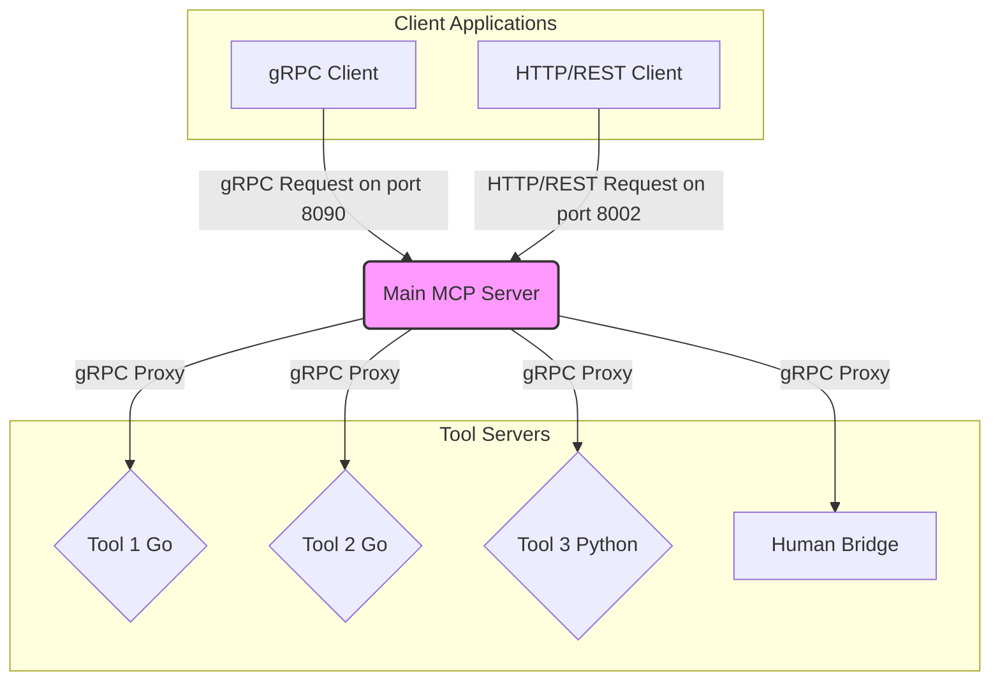
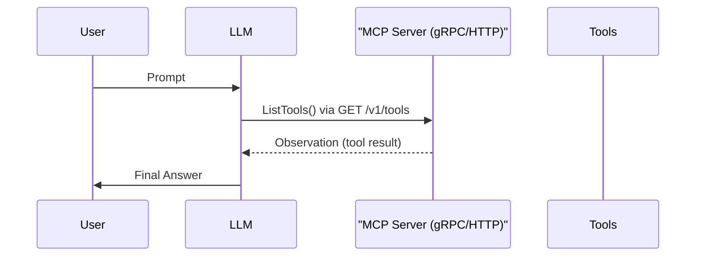

<div align="center">
  
  <h1>MCP-NG</h1>
  <p>A Go-Powered Universal Server for the Model Context Protocol (MCP)</p>
  <p>
    
    
    
    
    
  </p>
</div>

[Читать на русском](README_ru.md)

# MCP-NG: A Go-Powered Server for the Model Context Protocol

MCP-NG is a high-performance, modular server implementation for Anthropic's **Model Context Protocol (MCP)**. Written entirely in Go, this project provides a robust and universal framework for orchestrating intelligent agents by exposing a diverse set of tools through a unified gRPC API.

The core philosophy of this project is to create a language-agnostic, microservices-based ecosystem. This allows for the seamless integration of tools written in any language, from general-purpose utilities in Go to specialized Machine Learning tools in Python.

## Key Features

*   **High-Performance Go Core:** The main server is built in Go, offering excellent performance, concurrency, and reliability for orchestrating multiple tool servers.
*   **Dual gRPC & HTTP/REST API:** The server exposes its services via both high-performance gRPC (default port 8090) and a standard HTTP/REST API (default port 8002) using gRPC-Gateway. This provides maximum flexibility for any client, from system-level integrations to simple web scripts.
*   **Universal gRPC-Based Communication:** The internal backbone uses gRPC, ensuring a language-agnostic, strongly-typed, and efficient protocol for all tool interactions.
*   **Microservice Architecture:** Every tool is an independent microservice, allowing for independent development, deployment, and scaling.
*   **Advanced ML Tool Integration:** The platform is designed to integrate seamlessly with resource-intensive Machine Learning tools (e.g., for text summarization, semantic search), treating them as first-class citizens in the agent's toolkit.
*   **Automatic Tool Discovery & Health Monitoring:** The server automatically discovers and launches registered tools, continuously monitors their health via gRPC health checks, and ensures that only healthy tools are available to agents.

## Architecture

I have designed MCP-NG with a focus on modularity and scalability. The core of the system is the **Main MCP Server**, which acts as a central hub for the various tool servers. Client applications, such as chatbots or other autonomous agents, communicate with the Main MCP Server to access the available tools via either gRPC or HTTP/REST.



### Key Components

*   **Main MCP Server:** The central component that discovers, launches, and routes requests from clients to the appropriate tool servers. It also monitors the health of each tool.
*   **Tool Servers:** Standalone gRPC servers that each provide a specific functionality (e.g., `calculator`, `web_search`). These can be written in any language, though the current implementation includes tools in Go and Python.
*   **Human Bridge:** A WebSocket server that facilitates asynchronous communication with a human operator, used by the `human_input` tool.
*   **gRPC Contract:** The API is defined in `proto/mcp.proto`, which serves as a single source of truth for all services.

### Health Checks

To ensure system reliability, I have implemented a comprehensive health check mechanism. The Main MCP Server is responsible for monitoring the status of all registered tools.

*   **Protocol:** The system uses the standard [gRPC Health Checking Protocol](https://github.com/grpc/grpc/blob/master/doc/health-checking.md).
*   **Implementation:** Every tool, whether written in Go or Python, exposes a gRPC health check endpoint.
*   **Monitoring:** The Main MCP Server performs an initial health check upon discovering a tool and continues to monitor it periodically. Tools that are not "SERVING" are not included in the list of available tools returned to clients, preventing requests from being routed to unhealthy services.

## Folder Structure

The project is organized into the following directories:

```
.
├── MCP-NG/
│   ├── human_bridge/     # WebSocket server for human interaction
│   ├── integration_tests/ # Integration tests for the tools
│   ├── proto/            # gRPC protocol buffer definitions
│   ├── server/           # Main MCP server implementation
│   └── tools/            # Source code for the individual tools
│       ├── go/           # Go-based tools
│       └── python/       # Python-based tools
├── docs/                 # English documentation
│   └── tools/            # Detailed documentation for each tool
├── docs_ru/              # Russian documentation
│   └── tools/            # Detailed Russian documentation for each tool
├── README.md             # This file
└── README_ru.md          # Russian version of this file
```

## Getting Started

### 1. Running with Docker (Recommended)

Thanks to Docker, you can build and run the entire MCP-NG ecosystem, including the main server and all tools, with a single command. This is the easiest and most reliable way to get started.

1.  **Ensure Docker is running on your machine.**
2.  From the root of the project directory, run the following command:

    ```bash
    docker-compose up --build -d
    ```

This command will:
*   Build the multi-stage Docker image, which compiles all Go binaries and installs all Python dependencies.
*   Start the container in detached mode (`-d`).
*   The server will be available on `grpc://localhost:8090` and `http://localhost:8002`.
*   The tools directory (`./MCP-NG/tools`) is mounted as a volume, so you can add or modify tools without rebuilding the image.

To stop the services, run `docker-compose down`.

### 2. Manual Setup on Linux / WSL

If you prefer to run the server without Docker in a Unix-like environment, you can follow these steps. To get started with MCP-NG, you will need to have Go, Python, and Protocol Buffers installed.

#### a. Clone the Repository

```bash
git clone https://github.com/Lotargo/MCP-NG.git
cd MCP-NG
```

#### b. Install Dependencies

**Go:**

```bash
go mod tidy
```

**Python:**

Use the dependency file intended for Linux.

```bash
pip install -r requirements_for_linux.txt
```

#### c. Run the Server

The main server will automatically launch all the tools.

```bash
cd MCP-NG/server/cmd/server
go run main.go
```

### 3. Manual Setup on Windows (Native)

This guide is for running the project natively on Windows without using WSL. This approach provides maximum performance and stability in a Windows environment.

#### a. Install Required Software

*   **Go:** Download and install Go from the official website ([go.dev](https://go.dev)).
*   **Python:** Download and install Python ([python.org](https://python.org)). During installation, make sure to check "Add Python to PATH".
*   **Git for Windows:** Install Git ([git-scm.com](https://git-scm.com)). This will also provide access to useful Unix utilities.
*   **MinGW (C/C++ compiler):** Required for some Go packages (e.g., `go-sqlite3`).
    *   Install MSYS2 from [msys2.org](https://msys2.org).
    *   Run the MSYS2 MINGW64 terminal and execute `pacman -Syu`, then `pacman -S --needed base-devel mingw-w64-ucrt-x86_64-toolchain`.
    *   Add `C:\msys64\ucrt64\bin` to your system PATH variable.

#### b. Clone the Repository

```powershell
git clone https://github.com/Lotargo/MCP-NG.git
cd MCP-NG
```

#### c. Environment Setup and Dependency Installation

This step is automated using a special PowerShell script. It will install all dependencies, compile Go microservices, and automatically configure Windows Firewall rules to avoid pop-ups.

1.  Open PowerShell terminal **as Administrator**. This is required for firewall management.
2.  Navigate to the project root folder.
3.  Create and activate a Python virtual environment:

    ```powershell
    python -m venv .venv
    .\.venv\Scripts\activate
    ```

4.  Run the automatic setup script. It uses the `requirements_for_windows.txt` file for correct Python package installation.

    ```powershell
    PowerShell -ExecutionPolicy Bypass -File .\install_deps.ps1
    ```

#### d. Configure Go Workspaces

The project uses Go Workspaces to manage multiple modules. Set up the workspace by adding the main server and all microservices to it.

1.  Ensure you are in the project root folder.
2.  Initialize `go.work` and add modules:

    ```powershell
    go work init
    go work use ./MCP-NG/server
    go work use ./MCP-NG/tools/go/...
    ```

#### e. Run the Server

Everything is now ready to launch. The main server will automatically discover and start all compiled microservices.

```powershell
go run ./MCP-NG/server/cmd/server/main.go
```

### Note on R&D Modules

By default, the server does not launch the resource-intensive Python-based ML tools (`hybrid_search` and others). I have designated these as **R&D (Research and Development)** modules to ensure a fast and stable startup for the core system. Their behavior can be modified in the server's source code.

### Tool Configuration

Each tool has its own `config.json` file for configuration. This file includes the port, the command to run the tool, and any other required settings (e.g., API keys). When deploying a tool to a new environment or MCP server, you will need to update its configuration file.

Please refer to the detailed documentation for each tool in the `docs/tools` directory for specific configuration instructions.

## ReAct Workflow

MCP-NG is designed to work with large language models (LLMs) using the ReAct (Reason and Act) pattern. This allows an LLM to intelligently select and use the available tools to accomplish a given task.



For more information on how to integrate MCP-NG with an LLM and use the ReAct pattern, please see the [Integration Guide](docs/integration_guide.md). List of available tools
    LLM->>LLM: Reason which tool to use
    LLM->>"MCP Server (gRPC/HTTP)": RunTool(tool_name, args) via POST /v1/tools:run
    "MCP Server (gRPC/HTTP)"->>Tools: Execute tool via gRPC
    Tools-->>"MCP Server (gRPC/HTTP)": Tool output
    "MCP Server (gRPC/HTTP)"-->>LLM: