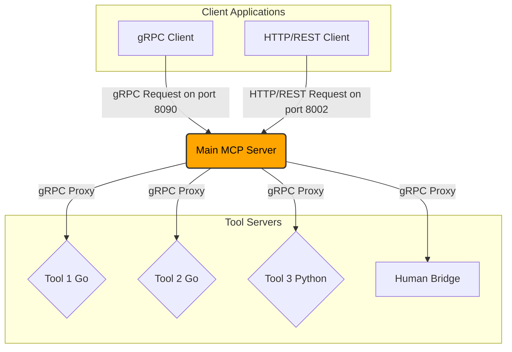
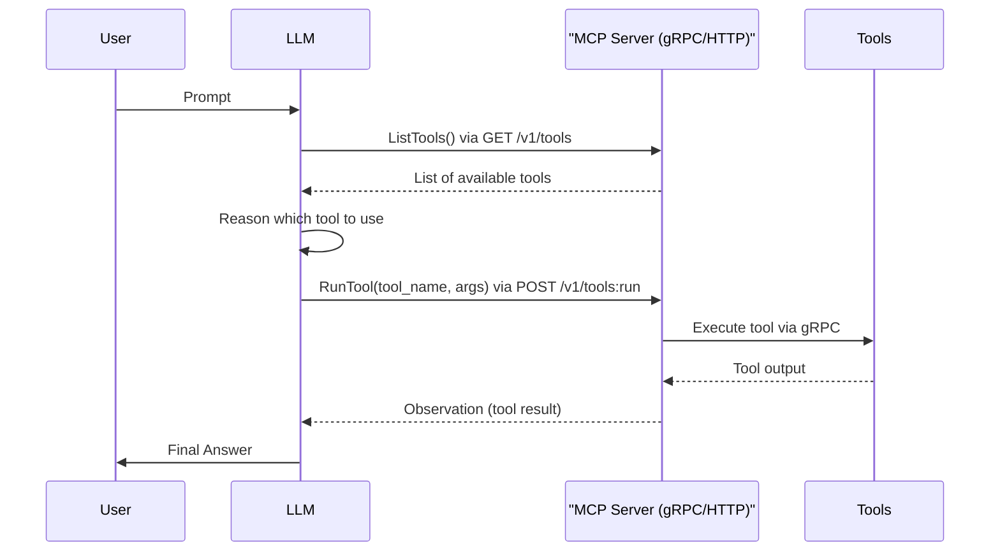

  
  <h1>MCP-NG</h1>
  
A Go-Powered Universal Server for the Model Context Protocol (MCP)

  

    
    
    
    
    
  

[Читать на русском](README_ru.md)

<h1>MCP-NG: A Go-Powered Server for the Model Context Protocol</h1>

MCP-NG is a high-performance, modular server implementation for Anthropic's <strong>Model Context Protocol (MCP)</strong>. Written entirely in Go, this project provides a robust and universal framework for orchestrating intelligent agents by exposing a diverse set of tools through a unified gRPC API.

The core philosophy of this project is to create a language-agnostic, microservices-based ecosystem. This allows for the seamless integration of tools written in any language, from general-purpose utilities in Go to specialized Machine Learning tools in Python.

<h2>Key Features</h2>

<ul>
<li><strong>High-Performance Go Core:</strong> The main server is built in Go, offering excellent performance, concurrency, and reliability for orchestrating multiple tool servers.</li>
<li><strong>Dual gRPC &amp; HTTP/REST API:</strong> The server exposes its services via both high-performance gRPC (default port 8090) and a standard HTTP/REST API (default port 8002) using gRPC-Gateway. This provides maximum flexibility for any client, from system-level integrations to simple web scripts.</li>
<li><strong>Universal gRPC-Based Communication:</strong> The internal backbone uses gRPC, ensuring a language-agnostic, strongly-typed, and efficient protocol for all tool interactions.</li>
<li><strong>Microservice Architecture:</strong> Every tool is an independent microservice, allowing for independent development, deployment, and scaling.</li>
<li><strong>Advanced ML Tool Integration:</strong> The platform is designed to integrate seamlessly with resource-intensive Machine Learning tools (e.g., for text summarization, semantic search), treating them as first-class citizens in the agent's toolkit.</li>
<li><strong>Automatic Tool Discovery &amp; Health Monitoring:</strong> The server automatically discovers and launches registered tools, continuously monitors their health via gRPC health checks, and ensures that only healthy tools are available to agents.</li>
</ul>

<h2>Architecture</h2>

I have designed MCP-NG with a focus on modularity and scalability. The core of the system is the <strong>Main MCP Server</strong>, which acts as a central hub for the various tool servers. Client applications, such as chatbots or other autonomous agents, communicate with the Main MCP Server to access the available tools via either gRPC or HTTP/REST.

<h3>Key Components</h3>

<ul>
<li><strong>Main MCP Server:</strong> The central component that discovers, launches, and routes requests from clients to the appropriate tool servers. It also monitors the health of each tool.</li>
<li><strong>Tool Servers:</strong> Standalone gRPC servers that each provide a specific functionality (e.g., <code>calculator</code>, <code>web_search</code>). These can be written in any language, though the current implementation includes tools in Go and Python.</li>
<li><strong>Human Bridge:</strong> A WebSocket server that facilitates asynchronous communication with a human operator, used by the <code>human_input</code> tool.</li>
<li><strong>gRPC Contract:</strong> The API is defined in <code>proto/mcp.proto</code>, which serves as a single source of truth for all services.</li>
</ul>

<h3>Health Checks</h3>

To ensure system reliability, I have implemented a comprehensive health check mechanism. The Main MCP Server is responsible for monitoring the status of all registered tools.

<ul>
<li><strong>Protocol:</strong> The system uses the standard gRPC Health Checking Protocol.</li>
<li><strong>Implementation:</strong> Every tool, whether written in Go or Python, exposes a gRPC health check endpoint.</li>
<li><strong>Monitoring:</strong> The Main MCP Server performs an initial health check upon discovering a tool and continues to monitor it periodically. Tools that are not "SERVING" are not included in the list of available tools returned to clients, preventing requests from being routed to unhealthy services.</li>
</ul>

<h2>Folder Structure</h2>

The project is organized into the following directories:

<pre><code>
.
├── MCP-NG/
│   ├── human_bridge/     # WebSocket server for human interaction
│   ├── integration_tests/ # Integration tests for the tools
│   ├── proto/            # gRPC protocol buffer definitions
│   ├── server/           # Main MCP server implementation
│   └── tools/            # Source code for the individual tools
│       ├── go/           # Go-based tools
│       └── python/       # Python-based tools
├── docs/                 # English documentation
│   └── tools/            # Detailed documentation for each tool
├── docs_ru/              # Russian documentation
│   └── tools/            # Detailed Russian documentation for each tool
├── README.md             # This file
└── README_ru.md          # Russian version of this file
</code></pre>

<h2>Getting Started</h2>

The MCP-NG project supports three primary environments: via Docker, natively on Windows, and natively on Linux/WSL. The recommended and easiest method is using Docker.

<h3>1. Running with Docker (Recommended)</h3>

Thanks to Docker, you can build and run the entire MCP-NG ecosystem, including the main server and all tools, with a single command. This method ensures an identical environment for both development and deployment.

<ol>
<li><strong>Ensure Docker and Docker Compose are installed and running.</strong></li>
<li>From the root of the project directory, run the following command:</li>
</ol>
<pre><code>docker-compose up --build -d</code></pre>

This command will build a multi-stage Docker image that compiles all Go binaries, installs all Python dependencies, and starts the container in the background. The server will be available at <code>grpc://localhost:8090</code> and <code>http://localhost:8002</code>.

To stop the services, run <code>docker-compose down</code>.

<h3>2. Manual Setup on Windows (Native)</h3>

This guide is for running the project directly on Windows without using WSL. This approach provides maximum performance for local development.

<h4>a. Install Required Software (One-time setup)</h4>
<ul>
<li><strong>Go:</strong> Download and install Go from the official website (<a href="https://go.dev">go.dev</a>).</li>
<li><strong>Python:</strong> Download and install Python (<a href="https://python.org">python.org</a>). During installation, make sure to check "Add Python to PATH".</li>
<li><strong>Git for Windows:</strong> Install Git (<a href="https://git-scm.com">git-scm.com</a>).</li>
<li><strong>MinGW (C/C++ compiler):</strong> Required for some Go packages (e.g., <code>go-sqlite3</code>).
<ul>
<li>Install MSYS2 from <a href="https://msys2.org">msys2.org</a>.</li>
<li>Run the MSYS2 MINGW64 terminal and execute <code>pacman -Syu</code>, then <code>pacman -S --needed base-devel mingw-w64-ucrt-x86_64-toolchain</code>.</li>
<li>Add the path <code>C:\msys64\ucrt64\bin</code> to your system's PATH environment variable.</li>
</ul>
</li>
</ul>
<h4>b. Clone the Repository</h4>
<pre><code>git clone https://github.com/Lotargo/MCP-NG.git
cd MCP-NG</code></pre>
<h4>c. Automatic Environment Setup</h4>

This step is automated using a PowerShell script. It will create a virtual environment, install all dependencies, compile all Go applications (including the main server) into a <code>bin</code> folder, and automatically configure Windows Firewall rules.

<ol>
<li>Open a PowerShell terminal <strong>as Administrator</strong>.</li>
<li>Navigate to the project root folder.</li>
<li>Create a virtual environment (done once):</li>
</ol>
<pre><code>python -m venv .venv</code></pre>
<ol start="4">
<li>Run the automatic setup script:</li>
</ol>
<pre><code>PowerShell -ExecutionPolicy Bypass -File .\install_deps.ps1</code></pre>

This script prepares everything needed for the launch. Re-run it after pulling updates from Git that change dependencies or add new tools.

<h4>d. Run the Server</h4>

After the <code>install_deps.ps1</code> script completes, your project is ready to run.

<ol>
<li>Open a <strong>new, regular</strong> PowerShell terminal (not as an administrator).</li>
<li>Navigate to the project root folder.</li>
<li>Execute the command to run the compiled server:</li>
</ol>
<pre><code>.\bin\server.exe</code></pre>

The server will start and automatically launch all compiled microservices.

<h3>3. Manual Setup on Linux / WSL</h3>

The process is similar to the Windows setup and follows the "build first, then run" principle.

<h4>a. Install Required Software</h4>

Install Go, Python 3.11+, Git, and GCC (e.g., via <code>sudo apt install build-essential</code>).

<h4>b. Clone and Install Dependencies</h4>
<pre><code>git clone https://github.com/Lotargo/MCP-NG.git
cd MCP-NG
python3 -m venv .venv
source .venv/bin/activate
pip install -r requirements_for_linux.txt</code></pre>
<h4>c. Build the Project</h4>

Compile the main server and all Go tools into the <code>bin</code> directory.

<pre><code>mkdir bin
go build -o ./bin/server ./MCP-NG/server/cmd/server
# Repeat for each Go tool
go build -o ./bin/api_caller ./MCP-NG/tools/go/api_caller
# ...and so on
</code></pre>
<h4>d. Run the Server</h4>

Run the compiled binary.

<pre><code>./bin/server</code></pre>
<h3>Note on R&D Modules</h3>

By default, the server does not launch the resource-intensive Python-based ML tools (<code>hybrid_search</code> and others). I have designated these as <strong>R&D (Research and Development)</strong> modules to ensure a fast and stable startup for the core system. Their behavior can be modified in the server's source code.

<h3>Tool Configuration</h3>

Each tool has its own <code>config.json</code> file. After all our changes, the configuration is now universal. It only specifies the name of the executable (e.g., <code>"command": ["api_caller"]</code>) or the script (<code>"command": ["server.py"]</code>). The main server now intelligently constructs the correct paths to run them based on the operating system.

Please refer to the detailed documentation for each tool in the <code>docs/tools</code> directory for specific configuration instructions.

<h2>ReAct Workflow</h2>

MCP-NG is designed to work with large language models (LLMs) using the ReAct (Reason and Act) pattern. This allows an LLM to intelligently select and use the available tools to accomplish a given task.

For more information on how to integrate MCP-NG with an LLM and use the ReAct pattern, please see the [Integration Guide](docs/integration_guide.md). List of available tools