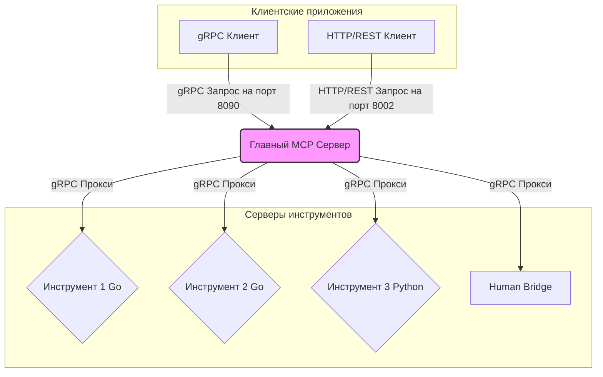
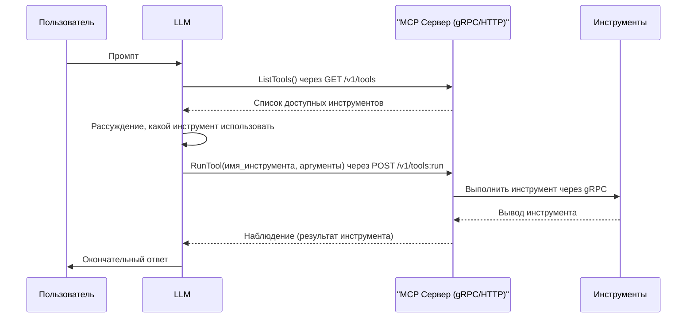

<div align="center">
  
  <h1>MCP-NG</h1>
  <p>A Go-Powered Universal Server for the Model Context Protocol (MCP)</p>
  <p>
    
    
    
    
    
  </p>
</div>

[Read in English](README.md)

# MCP-NG: Сервер на Go для Model Context Protocol

MCP-NG — это высокопроизводительная, модульная реализация сервера для **Model Context Protocol (MCP)** от Anthropic. Написанный полностью на Go, этот проект предоставляет надежный и универсальный фреймворк для оркестрации интеллектуальных агентов, предоставляя доступ к разнообразному набору инструментов через единый gRPC API.

Ключевая философия этого проекта — создание языконезависимой экосистемы на основе микросервисов. Это позволяет бесшовно интегрировать инструменты, написанные на любом языке — от утилит общего назначения на Go до специализированных инструментов машинного обучения на Python.

## Ключевые особенности

*   **Высокопроизводительное ядро на Go:** Главный сервер создан на Go, что обеспечивает превосходную производительность, параллелизм и надежность при оркестрации нескольких серверов-инструментов.
*   **Двойной API: gRPC и HTTP/REST:** Сервер предоставляет свои сервисы как через высокопроизводительный gRPC (порт по умолчанию 8090), так и через стандартный HTTP/REST API (порт по умолчанию 8002) с использованием gRPC-Gateway. Это обеспечивает максимальную гибкость для любого клиента, от системных интеграций до простых веб-скриптов.
*   **Универсальное взаимодействие на основе gRPC:** Внутренняя коммуникация использует gRPC, что гарантирует языконезависимый, строго типизированный и эффективный протокол для всех взаимодействий с инструментами.
*   **Микросервисная архитектура:** Каждый инструмент является независимым микросервисом, что позволяет осуществлять независимую разработку, развертывание и масштабирование.
*   **Продвинутая интеграция с ML-инструментами:** Платформа спроектирована для бесшовной интеграции с ресурсоемкими инструментами машинного обучения (например, для суммаризации текста, семантического поиска), рассматривая их как первоклассные компоненты в наборе инструментов агента.
*   **Автоматическое обнаружение инструментов и мониторинг состояния:** Сервер автоматически обнаруживает и запускает зарегистрированные инструменты, постоянно отслеживает их состояние с помощью gRPC health checks и гарантирует, что агентам доступны только работоспособные инструменты.

## Архитектура

Я спроектировал MCP-NG с упором на модульность и масштабируемость. Ядром системы является **Главный MCP Сервер**, который действует как центральный узел для различных серверов инструментов. Клиентские приложения, такие как чат-боты или другие автономные агенты, взаимодействуют с Главным MCP Сервером для доступа к доступным инструментам через gRPC или HTTP/REST.



### Ключевые компоненты

*   **Главный MCP Сервер:** Центральный компонент, который обнаруживает, запускает и направляет запросы от клиентов к соответствующим серверам инструментов. Он также отслеживает состояние каждого инструмента.
*   **Серверы инструментов:** Автономные gRPC-серверы, каждый из которых предоставляет определенную функциональность (например, `calculator`, `web_search`). Они могут быть написаны на любом языке, хотя текущая реализация включает инструменты на Go и Python.
*   **Human Bridge:** WebSocket-сервер, который обеспечивает асинхронное взаимодействие с оператором-человеком и используется инструментом `human_input`.
*   **gRPC Контракт:** API определен в `proto/mcp.proto`, который служит единым источником истины для всех сервисов.

### Проверки состояния (Health Checks)

Для обеспечения надежности системы я реализовал комплексный механизм проверки состояния. Главный MCP Сервер отвечает за мониторинг статуса всех зарегистрированных инструментов.

*   **Протокол:** Система использует стандартный [протокол проверки состояния gRPC](https://github.com/grpc/grpc/blob/master/doc/health-checking.md).
*   **Реализация:** Каждый инструмент, будь то на Go или Python, предоставляет конечную точку для проверки состояния по gRPC.
*   **Мониторинг:** Главный MCP Сервер выполняет начальную проверку состояния при обнаружении инструмента и продолжает периодически его отслеживать. Инструменты, которые не находятся в состоянии "SERVING", не включаются в список доступных инструментов, возвращаемый клиентам, что предотвращает маршрутизацию запросов к неработоспособным сервисам.

## Структура папок

Проект организован в следующих каталогах:

```
.
├── MCP-NG/
│   ├── human_bridge/     # WebSocket-сервер для взаимодействия с человеком
│   ├── integration_tests/ # Интеграционные тесты для инструментов
│   ├── proto/            # Определения protocol buffer для gRPC
│   ├── server/           # Реализация главного MCP сервера
│   └── tools/            # Исходный код для отдельных инструментов
│       ├── go/           # Инструменты на Go
│       └── python/       # Инструменты на Python
├── docs/                 # Документация на английском
│   └── tools/            # Подробная документация для каждого инструмента
├── docs_ru/              # Документация на русском
│   └── tools/            # Подробная документация для каждого инструмента на русском
├── README.md             # Файл README на английском
└── README_ru.md          # Этот файл
```

## Начало работы

### 1. Запуск с помощью Docker (Рекомендуемый способ)

Благодаря Docker, вы можете собрать и запустить всю экосистему MCP-NG, включая главный сервер и все инструменты, одной командой. Это самый простой и надежный способ начать работу.

1.  **Убедитесь, что Docker запущен на вашем компьютере.**
2.  Из корневого каталога проекта выполните следующую команду:

    ```bash
    docker-compose up --build -d
    ```

Эта команда:
*   Соберет многоступенчатый Docker-образ, который скомпилирует все бинарные файлы Go и установит все зависимости Python.
*   Запустит контейнер в фоновом режиме (`-d`).
*   Сервер будет доступен по адресам `grpc://localhost:8090` и `http://localhost:8002`.
*   Каталог с инструментами (`./MCP-NG/tools`) монтируется как том, поэтому вы можете добавлять или изменять инструменты без пересборки образа.

Чтобы остановить сервисы, выполните `docker-compose down`.

### 2. Ручная настройка в Linux / WSL

Если вы предпочитаете запустить сервер без Docker в Unix-подобной среде, вы можете следовать этим шагам. Для начала работы с MCP-NG вам потребуется установить Go, Python и Protocol Buffers.

#### a. Клонируйте репозиторий

```bash
git clone https://github.com/Lotargo/MCP-NG.git
cd MCP-NG
```

#### b. Установите зависимости

**Go:**

```bash
go mod tidy
```

**Python:**

Используйте файл зависимостей, предназначенный для Linux.

```bash
pip install -r requirements_for_linux.txt
```

#### c. Запустите сервер

Главный сервер автоматически запустит все инструменты.

```bash
cd MCP-NG/server/cmd/server
go run main.go
```

### 3. Ручная настройка в Windows (Native)

Этот гайд предназначен для запуска проекта напрямую в Windows без использования WSL. Этот способ обеспечивает максимальную производительность и стабильность в среде Windows.

#### a. Установка необходимого ПО

*   **Go:** Скачайте и установите Go с официального сайта ([go.dev](https://go.dev)).
*   **Python:** Скачайте и установите Python ([python.org](https://python.org)). Во время установки обязательно поставьте галочку "Add Python to PATH".
*   **Git for Windows:** Установите Git ([git-scm.com](https://git-scm.com)). Это также предоставит вам доступ к полезным Unix-утилитам.
*   **MinGW (C/C++ компилятор):** Необходим для некоторых Go-пакетов (например, `go-sqlite3`).
    *   Установите MSYS2 с [msys2.org](https://msys2.org).
    *   Запустите терминал MSYS2 MINGW64 и выполните `pacman -Syu`, а затем `pacman -S --needed base-devel mingw-w64-ucrt-x86_64-toolchain`.
    *   Добавьте `C:\msys64\ucrt64\bin` в системную переменную PATH.

#### b. Клонируйте репозиторий

```powershell
git clone https://github.com/Lotargo/MCP-NG.git
cd MCP-NG
```

#### c. Настройка среды и установка зависимостей

Этот шаг автоматизирован с помощью специального скрипта PowerShell. Он установит все зависимости, скомпилирует Go-микросервисы и автоматически настроит правила Брандмауэра Windows, чтобы избежать всплывающих окон.

1.  Откройте терминал PowerShell **от имени Администратора**. Это необходимо для управления брандмауэром.
2.  Перейдите в корневую папку проекта.
3.  Создайте и активируйте виртуальное окружение Python:

    ```powershell
    python -m venv .venv
    .\.venv\Scripts\activate
    ```

4.  Запустите скрипт автоматической настройки. Он использует файл `requirements_for_windows.txt` для корректной установки Python-пакетов.

    ```powershell
    PowerShell -ExecutionPolicy Bypass -File .\install_deps.ps1
    ```

#### d. Настройка Go Workspaces

Проект использует Go Workspaces для управления несколькими модулями. Настройте рабочую область, добавив в нее главный сервер и все микросервисы.

1.  Убедитесь, что вы находитесь в корневой папке проекта.
2.  Инициализируйте `go.work` и добавьте модули:

    ```powershell
    go work init
    go work use ./MCP-NG/server
    go work use ./MCP-NG/tools/go/...
    ```

#### e. Запустите сервер

Теперь все готово для запуска. Главный сервер автоматически обнаружит и запустит все скомпилированные микросервисы.

```powershell
go run ./MCP-NG/server/cmd/server/main.go
```

### Примечание о R&D модулях

По умолчанию сервер не запускает ресурсоемкие ML-инструменты на Python (`hybrid_search` и другие). Я обозначил их как модули **R&D (Исследования и Разработка)**, чтобы обеспечить быстрый и стабильный запуск основной системы. Их поведение можно изменить в исходном коде сервера.

### Конфигурация инструментов

У каждого инструмента есть свой файл `config.json` для конфигурации. Этот файл включает порт, команду для запуска инструмента и любые другие необходимые параметры (например, API-ключи). При развертывании инструмента в новой среде или на другом MCP-сервере вам потребуется обновить его конфигурационный файл.

Пожалуйста, обратитесь к подробной документации для каждого инструмента в каталоге `docs_ru/tools` для получения конкретных инструкций по настройке.

## Рабочий процесс ReAct

MCP-NG предназначен для работы с большими языковыми моделями (LLM) с использованием паттерна ReAct (Reason and Act). Это позволяет LLM интеллектуально выбирать и использовать доступные инструменты для выполнения поставленной задачи.



Для получения дополнительной информации о том, как интегрировать MCP-NG с LLM и использовать паттерн ReAct, пожалуйста, обратитесь к [Руководству по интеграции](docs_ru/integration_guide.md).