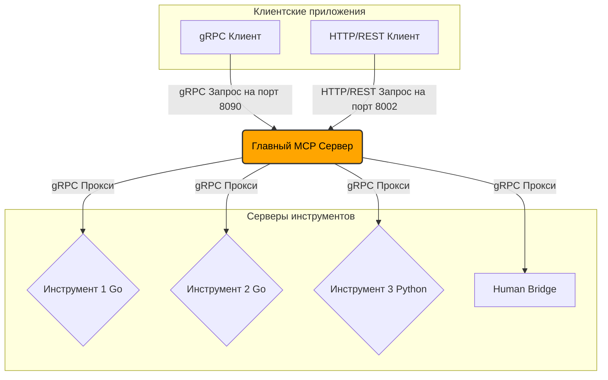
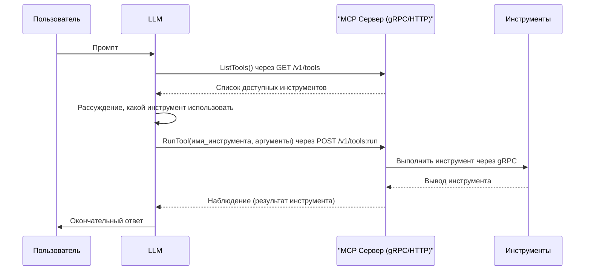

  
  <h1>MCP-NG</h1>
  
A Go-Powered Universal Server for the Model Context Protocol (MCP)

  

    
    
    
    
    
  

[Read in English](README.md)

<h1>MCP-NG: Сервер на Go для Model Context Protocol</h1>

MCP-NG — это высокопроизводительная, модульная реализация сервера для Model Context Protocol (MCP) от Anthropic. Написанный полностью на Go, этот проект предоставляет надежный и универсальный фреймворк для оркестрации интеллектуальных агентов, предоставляя доступ к разнообразному набору инструментов через единый gRPC API.

Ключевая философия этого проекта — создание языконезависимой экосистемы на основе микросервисов. Это позволяет бесшовно интегрировать инструменты, написанные на любом языке — от утилит общего назначения на Go до специализированных инструментов машинного обучения на Python.

<h2>Ключевые особенности</h2>

<ul>
<li><strong>Высокопроизводительное ядро на Go:</strong> Главный сервер создан на Go, что обеспечивает превосходную производительность, параллелизм и надежность при оркестрации нескольких серверов-инструментов.</li>
<li><strong>Двойной API: gRPC и HTTP/REST:</strong> Сервер предоставляет свои сервисы как через высокопроизводительный gRPC (порт по умолчанию 8090), так и через стандартный HTTP/REST API (порт по умолчанию 8002) с использованием gRPC-Gateway. Это обеспечивает максимальную гибкость для любого клиента, от системных интеграций до простых веб-скриптов.</li>
<li><strong>Универсальное взаимодействие на основе gRPC:</strong> Внутренняя коммуникация использует gRPC, что гарантирует языконезависимый, строго типизированный и эффективный протокол для всех взаимодействий с инструментами.</li>
<li><strong>Микросервисная архитектура:</strong> Каждый инструмент является независимым микросервисом, что позволяет осуществлять независимую разработку, развертывание и масштабирование.</li>
<li><strong>Продвинутая интеграция с ML-инструментами:</strong> Платформа спроектирована для бесшовной интеграции с ресурсоемкими инструментами машинного обучения (например, для суммаризации текста, семантического поиска), рассматривая их как первоклассные компоненты в наборе инструментов агента.</li>
<li><strong>Автоматическое обнаружение инструментов и мониторинг состояния:</strong> Сервер автоматически обнаруживает и запускает зарегистрированные инструменты, постоянно отслеживает их состояние с помощью gRPC health checks и гарантирует, что агентам доступны только работоспособные инструменты.</li>
</ul>

<h2>Архитектура</h2>

Я спроектировал MCP-NG с упором на модульность и масштабируемость. Ядром системы является Главный MCP Сервер, который действует как центральный узел для различных серверов инструментов. Клиентские приложения, такие как чат-боты или другие автономные агенты, взаимодействуют с Главным MCP Сервером для доступа к доступным инструментам через gRPC или HTTP/REST.

<h3>Ключевые компоненты</h3>

<ul>
<li><strong>Главный MCP Сервер:</strong> Центральный компонент, который обнаруживает, запускает и направляет запросы от клиентов к соответствующим серверам инструментов. Он также отслеживает состояние каждого инструмента.</li>
<li><strong>Серверы инструментов:</strong> Автономные gRPC-серверы, каждый из которых предоставляет определенную функциональность (например, <code>calculator</code>, <code>web_search</code>). Они могут быть написаны на любом языке, хотя текущая реализация включает инструменты на Go и Python.</li>
<li><strong>Human Bridge:</strong> WebSocket-сервер, который обеспечивает асинхронное взаимодействие с оператором-человеком и используется инструментом <code>human_input</code>.</li>
<li><strong>gRPC Контракт:</strong> API определен в <code>proto/mcp.proto</code>, который служит единым источником истины для всех сервисов.</li>
</ul>

<h3>Проверки состояния (Health Checks)</h3>

Для обеспечения надежности системы я реализовал комплексный механизм проверки состояния. Главный MCP Сервер отвечает за мониторинг статуса всех зарегистрированных инструментов.

<ul>
<li><strong>Протокол:</strong> Система использует стандартный протокол проверки состояния gRPC.</li>
<li><strong>Реализация:</strong> Каждый инструмент, будь то на Go или Python, предоставляет конечную точку для проверки состояния по gRPC.</li>
<li><strong>Мониторинг:</strong> Главный MCP Сервер выполняет начальную проверку состояния при обнаружении инструмента и продолжает периодически его отслеживать. Инструменты, которые не находятся в состоянии "SERVING", не включаются в список доступных инструментов, возвращаемый клиентам, что предотвращает маршрутизацию запросов к неработоспособным сервисам.</li>
</ul>

<h2>Структура папок</h2>

Проект организован в следующих каталогах:

<pre><code>
.
├── MCP-NG/
│   ├── human_bridge/     # WebSocket-сервер для взаимодействия с человеком
│   ├── integration_tests/ # Интеграционные тесты для инструментов
│   ├── proto/            # Определения protocol buffer для gRPC
│   ├── server/           # Реализация главного MCP сервера
│   └── tools/            # Исходный код для отдельных инструментов
│       ├── go/           # Инструменты на Go
│       └── python/       # Инструменты на Python
├── docs/                 # Документация на английском
│   └── tools/            # Подробная документация для каждого инструмента
├── docs_ru/              # Документация на русском
│   └── tools/            # Подробная документация для каждого инструмента на русском
├── README.md             # Файл README на английском
└── README_ru.md          # Этот файл
</code></pre>

<h2>Начало работы</h2>

<h3>1. Запуск с помощью Docker (Рекомендуемый способ)</h3>

Благодаря Docker, вы можете собрать и запустить всю экосистему MCP-NG, включая главный сервер и все инструменты, одной командой. Это самый простой и надежный способ начать работу.

<ol>
<li><strong>Убедитесь, что Docker запущен на вашем компьютере.</strong></li>
<li>Из корневого каталога проекта выполните следующую команду:</li>
</ol>

<pre><code>docker-compose up --build -d</code></pre>

Эта команда:

<ul>
<li>Соберет многоступенчатый Docker-образ, который скомпилирует все бинарные файлы Go и установит все зависимости Python.</li>
<li>Запустит контейнер в фоновом режиме (<code>-d</code>).</li>
<li>Сервер будет доступен по адресам <code>grpc://localhost:8090</code> и <code>http://localhost:8002</code>.</li>
<li>Каталог с инструментами (<code>./MCP-NG/tools</code>) монтируется как том, поэтому вы можете добавлять или изменять инструменты без пересборки образа.</li>
</ul>

Чтобы остановить сервисы, выполните <code>docker-compose down</code>.

<h3>2. Ручная настройка в Linux / WSL</h3>

Если вы предпочитаете запустить сервер без Docker в Unix-подобной среде, следуйте этим шагам. Вам потребуется установить Go, Python и Protocol Buffers.

<h4>a. Клонируйте репозиторий</h4>

<pre><code>git clone https://github.com/Lotargo/MCP-NG.git
cd MCP-NG</code></pre>

<h4>b. Установите зависимости</h4>

<strong>Go:</strong>

Находясь в корне проекта, настройте Workspace и скачайте зависимости для всех модулей.

<pre><code>go work init
go work use ./MCP-NG/server
go work use ./MCP-NG/tools/go/...
go mod tidy -C ./MCP-NG/server
# ... и так далее для каждого Go-инструмента</code></pre>

<strong>Python:</strong>

Создайте и активируйте виртуальное окружение, затем установите зависимости.

<pre><code>python3 -m venv .venv
source .venv/bin/activate
pip install -r requirements_for_linux.txt</code></pre>

<h4>c. Запустите сервер</h4>

Запуск необходимо производить из корневой директории проекта. Главный сервер автоматически обнаружит и запустит все инструменты.

<pre><code>go run ./MCP-NG/server/cmd/server/main.go</code></pre>

<h3>3. Ручная настройка в Windows (Native)</h3>

Этот гайд предназначен для запуска проекта напрямую в Windows без использования WSL. Этот способ обеспечивает максимальную производительность и стабильность в среде Windows.

<h4>a. Установка необходимого ПО</h4>

<ul>
<li><strong>Go:</strong> Скачайте и установите Go с официального сайта <a href="https://go.dev">go.dev</a>.</li>
<li><strong>Python:</strong> Скачайте и установите Python <a href="https://python.org">python.org</a>. Во время установки обязательно поставьте галочку "Add Python to PATH".</li>
<li><strong>Git for Windows:</strong> Установите Git <a href="https://git-scm.com">git-scm.com</a>.</li>
<li><strong>MinGW (C/C++ компилятор):</strong> Необходим для некоторых Go-пакетов (например, <code>go-sqlite3</code>).
<ul>
<li>Установите MSYS2 с <a href="https://msys2.org">msys2.org</a>.</li>
<li>Запустите терминал MSYS2 MINGW64 и выполните <code>pacman -Syu</code>, а затем <code>pacman -S --needed base-devel mingw-w64-ucrt-x86_64-toolchain</code>.</li>
<li>Добавьте <code>C:\msys64\ucrt64\bin</code> в системную переменную PATH.</li>
</ul>
</li>
</ul>

<h4>b. Клонируйте репозиторий</h4>

<pre><code>git clone https://github.com/Lotargo/MCP-NG.git
cd MCP-NG</code></pre>

<h4>c. Автоматическая настройка среды</h4>

Этот шаг автоматизирован с помощью специального скрипта PowerShell. Он создаст виртуальное окружение, установит все зависимости, скомпилирует все Go-приложения (включая главный сервер) в папку <code>bin</code> и настроит правила Брандмауэра Windows.

<ol>
<li>Откройте терминал PowerShell от имени Администратора.</li>
<li>Перейдите в корневую папку проекта.</li>
<li>Создайте виртуальное окружение (выполняется один раз):</li>
</ol>

<pre><code>python -m venv .venv</code></pre>

<ol start="4">
<li>Запустите скрипт автоматической настройки:</li>
</ol>

<pre><code>PowerShell -ExecutionPolicy Bypass -File .\install_deps.ps1</code></pre>

Этот скрипт подготовит всё необходимое для запуска.

<h4>d. Запуск сервера</h4>

После завершения работы скрипта <code>install_deps.ps1</code> ваш проект готов к запуску.

<ol>
<li>Откройте новый, обычный терминал PowerShell (не от администратора).</li>
<li>Перейдите в корневую папку проекта.</li>
<li>Выполните команду для запуска скомпилированного сервера:</li>
</ol>

<pre><code>.\bin\server.exe</code></pre>

Сервер запустится и автоматически поднимет все скомпилированные микросервисы.

<h3>Примечание о R&amp;D модулях</h3>

По умолчанию сервер не запускает ресурсоемкие ML-инструменты на Python (<code>hybrid_search</code> и другие). Я обозначил их как модули <strong>R&amp;D (Исследования и Разработка)</strong>, чтобы обеспечить быстрый и стабильный запуск основной системы. Их поведение можно изменить в исходном коде сервера.

<h3>Конфигурация инструментов</h3>

У каждого инструмента есть свой файл <code>config.json</code> для конфигурации. Для локальной разработки в Windows скрипт <code>install_deps.ps1</code> автоматически компилирует все Go-инструменты, и главный сервер запускает их как исполняемые файлы. Для разработки в Linux/WSL или для Docker-сборки убедитесь, что команды в <code>config.json</code> соответствуют вашей среде (<code>go run .</code>, <code>python server.py</code> или имя бинарного файла).

Пожалуйста, обратитесь к подробной <a href= "https://github.com/Lotargo/MCP-NG/tree/main/docs_ru/tools">документации</a></li> для каждого инструмента в каталоге для получения конкретных инструкций по настройке.

<h2>Рабочий процесс ReAct</h2>

MCP-NG предназначен для работы с большими языковыми моделями (LLM) с использованием паттерна ReAct (Reason and Act). Это позволяет LLM интеллектуально выбирать и использовать доступные инструменты для выполнения поставленной задачи.

Для получения дополнительной информации о том, как интегрировать MCP-NG с LLM и использовать паттерн ReAct, пожалуйста, обратитесь к [Руководству по интеграции](docs_ru/integration_guide.md).
