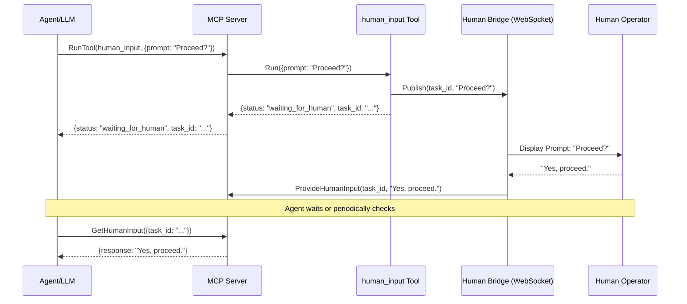

# Human Input Tool

## Description

The `human_input` tool is a Go-based gRPC service that facilitates asynchronous interaction with a human operator. It is designed for situations where an autonomous agent needs to pause its execution, ask for clarification, or get approval for a critical or irreversible action.

The tool integrates with the **Human Bridge** WebSocket server, which acts as a message broker to relay prompts to a human-facing client (e.g., a web UI) and receive their responses.

## Asynchronous Workflow

The interaction with this tool is a two-step process:

1.  **Request Input:** The agent calls the `human_input` tool with a `prompt`. The tool immediately sends the prompt to the Human Bridge and returns a `task_id` to the agent without waiting for the human's answer.
2.  **Retrieve Response:** The human operator sees the prompt in their UI and provides a response. This response is sent back to the main MCP server, which stores it. The agent can then use the `GetHumanInput` gRPC method on the main MCP server (or the corresponding REST endpoint) with the `task_id` to retrieve the human's response once it's available.

### Workflow Diagram



## Parameters

The tool accepts a single argument in a JSON object:

| Parameter | Type     | Required | Description                               |
|-----------|----------|----------|-------------------------------------------|
| `prompt`  | `string` | **Yes**  | The question or prompt to show the human. |

## Response

The tool **immediately** returns a JSON object with the following fields:

| Field     | Type     | Description                                           |
|-----------|----------|-------------------------------------------------------|
| `status`  | `string` | Always `"waiting_for_human"`.                         |
| `task_id` | `string` | A unique identifier for this interaction task. |

## Usage Example

### Step 1: Request Human Input

**Request:**

```bash
curl -X POST http://localhost:8002/v1/tools:run \
-d '{
  "name": "human_input",
  "arguments": {
    "prompt": "The next step is to delete the user account. Do you approve?"
  }
}'
```

**Immediate Response:**

```json
{
  "result": {
    "structValue": {
      "fields": {
        "status": { "stringValue": "waiting_for_human" },
        "task_id": { "stringValue": "a1b2c3d4-e5f6-4a7b-8c9d-0e1f2a3b4c5d" }
      }
    }
  }
}
```

### Step 2: Retrieve Human Response

After the human submits their answer, the agent can retrieve it from the main MCP server's `/v1/human-input/{task_id}` endpoint.

**Request:**

```bash
curl http://localhost:8002/v1/human-input/a1b2c3d4-e5f6-4a7b-8c9d-0e1f2a3b4c5d
```

**Response from MCP Server (after human replies):**

```json
{
  "response": "Yes, I approve. Proceed with deletion."
}
```

## Configuration

The tool requires a `config.json` file specifying its port and the address of the message broker.

**Example `config.json`:**
```json
{
  "port": 50056,
  "command": ["go", "run", "."],
  "broker": {
    "type": "websocket",
    "address": "localhost:8080"
  }
}
```

## Health and Logging

*   **Health Checks:** Implements the standard gRPC Health Checking Protocol.
*   **Logging:** Uses a structured JSON logger (`slog`).