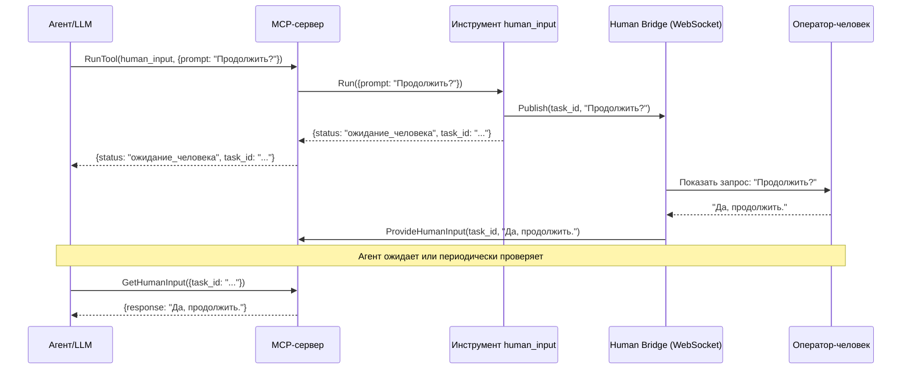

# Инструмент Human Input

## Описание

Инструмент `human_input` — это gRPC-сервис на Go, который обеспечивает асинхронное взаимодействие с оператором-человеком. Он предназначен для ситуаций, когда автономному агенту необходимо приостановить свое выполнение, запросить уточнение или получить одобрение на критическое или необратимое действие.

Инструмент интегрируется с WebSocket-сервером **Human Bridge**, который выступает в роли брокера сообщений для передачи запросов клиенту, с которым работает человек (например, веб-интерфейсу), и получения ответов.

## Асинхронный рабочий процесс

Взаимодействие с этим инструментом представляет собой двухэтапный процесс:

1.  **Запрос ввода:** Агент вызывает инструмент `human_input` с параметром `prompt`. Инструмент немедленно отправляет запрос на Human Bridge и возвращает агенту `task_id`, не дожидаясь ответа человека.
2.  **Получение ответа:** Оператор-человек видит запрос в своем интерфейсе и предоставляет ответ. Этот ответ отправляется на главный MCP-сервер, который его сохраняет. Затем агент может использовать gRPC-метод `GetHumanInput` на главном MCP-сервере (или соответствующую REST-конечную точку) с `task_id`, чтобы получить ответ человека, как только он станет доступен.

### Диаграмма рабочего процесса



## Параметры

Инструмент принимает один аргумент в виде JSON-объекта:

| Параметр | Тип      | Обязательный | Описание                                  |
|-----------|----------|--------------|-------------------------------------------|
| `prompt`  | `string` | **Да**       | Вопрос или запрос для отображения человеку. |

## Ответ

Инструмент **немедленно** возвращает JSON-объект со следующими полями:

| Поле      | Тип      | Описание                                           |
|-----------|----------|----------------------------------------------------|
| `status`  | `string` | Всегда `"waiting_for_human"`.                      |
| `task_id` | `string` | Уникальный идентификатор для этой задачи взаимодействия. |

## Пример использования

### Шаг 1: Запрос ввода от человека

**Запрос:**

```bash
curl -X POST http://localhost:8002/v1/tools:run \
-d '{
  "name": "human_input",
  "arguments": {
    "prompt": "Следующий шаг — удаление учетной записи пользователя. Вы одобряете?"
  }
}'
```

**Немедленный ответ:**

```json
{
  "result": {
    "structValue": {
      "fields": {
        "status": { "stringValue": "waiting_for_human" },
        "task_id": { "stringValue": "a1b2c3d4-e5f6-4a7b-8c9d-0e1f2a3b4c5d" }
      }
    }
  }
}
```

### Шаг 2: Получение ответа человека

После того как человек отправит свой ответ, агент может получить его с конечной точки `/v1/human-input/{task_id}` главного MCP-сервера.

**Запрос:**

```bash
curl http://localhost:8002/v1/human-input/a1b2c3d4-e5f6-4a7b-8c9d-0e1f2a3b4c5d
```

**Ответ от MCP-сервера (после ответа человека):**

```json
{
  "response": "Да, я одобряю. Продолжайте удаление."
}
```

## Конфигурация

Инструменту требуется файл `config.json`, указывающий его порт и адрес брокера сообщений.

**Пример `config.json`:**
```json
{
  "port": 50056,
  "command": ["go", "run", "."],
  "broker": {
    "type": "websocket",
    "address": "localhost:8080"
  }
}
```

## Проверки состояния и логирование

*   **Проверки состояния:** Реализует стандартный протокол gRPC Health Checking Protocol.
*   **Логирование:** Использует структурированный JSON-логгер (`slog`).